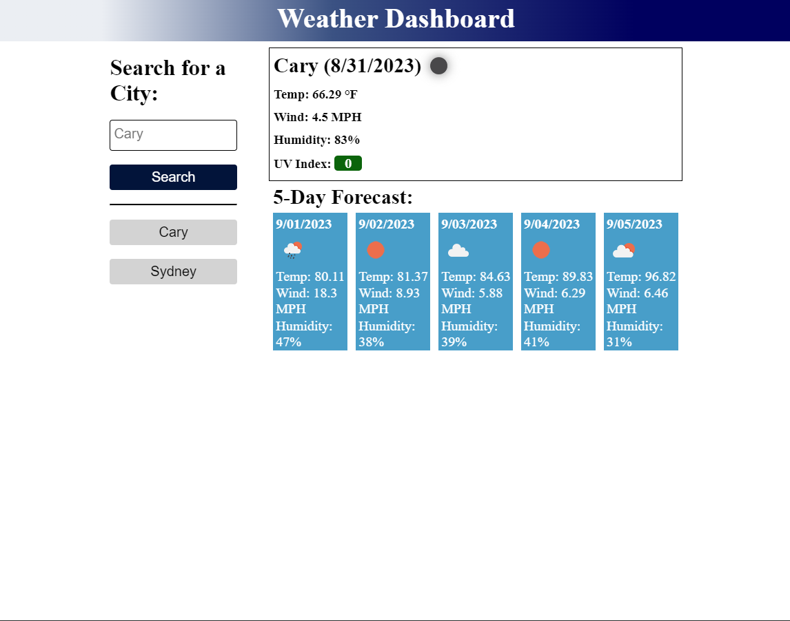

# 5-Day-Weather-Dashboard
Weather dashboard to display a 5 day forecast for a given area

# User Story
AS A traveler  
I WANT to see the weather outlook for multiple cities  
SO THAT I can plan a trip accordingly  

# Acceptance Criteria
GIVEN a weather dashboard with form inputs  
WHEN I search for a city  
THEN I am presented with current and future conditions for that city and that city is added to the search history  
WHEN I view current weather conditions for that city  
THEN I am presented with the city name, the date, an icon representation of weather conditions, the temperature, the humidity, and the the wind speed  
WHEN I view future weather conditions for that city  
THEN I am presented with a 5-day forecast that displays the date, an icon representation of weather conditions, the temperature, the wind speed, and the humidity  
WHEN I click on a city in the search history  
THEN I am again presented with current and future conditions for that city  

# Mock-up of Site

# Link to Live Site
https://thomas-barnhart.github.io/5-Day-Weather-Dashboard/

# Link to GitHub
https://github.com/Thomas-Barnhart/5-Day-Weather-Dashboard

# Final Use
Created a weather dashboard that pulls the 5 day forecast for a given area and displays it.  In addition, saves the locations searched to the local for quick recall.